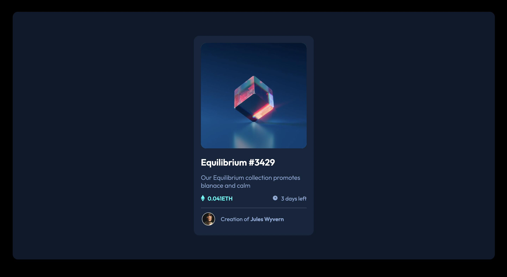
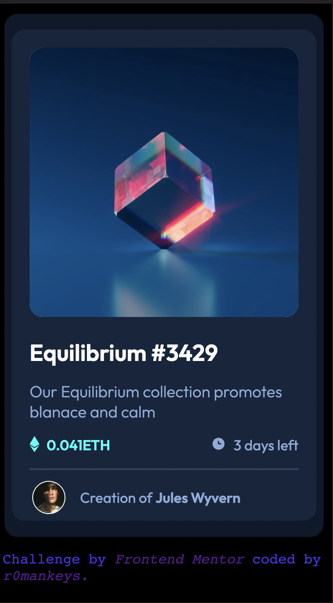

# Frontend Mentor - NFT Preview card component solution 

This is a solution to the [NFT preview card component challenge on Frontend Mentor](https://www.frontendmentor.io/challenges/nft-preview-card-component-SbdUL_w0U). 

## Table of contents
- [Frontend Mentor - NFT Preview card component solution](#frontend-mentor---nft-preview-card-component-solution)
  - [Table of contents](#table-of-contents)
  - [Overview](#overview)
    - [Screenshots](#screenshots)
    - [Links](#links)
  - [My process](#my-process)
    - [Built with](#built-with)
    - [What I learned](#what-i-learned)
    - [Continued development](#continued-development)
  - [Author](#author)

--- 

## Overview

This challenge had me frustrated, not understanding how to make the NFT appear differently on `:hover` state and having trouble in general with the styling to the point I scarpped it and tried again twice. Having gone through that and finally completing it I eventually leraned a valuable lesson with programming: resiliance is key. I didn't know the answer to my problem and didn't want to search the solution because I felt I could figure it out on my own it so I took a break. That break was essential to finishing the project because it allowed me to come back with fresh ideas and I eventually realised the problem was way less complicated than I was making it and I even learned a new CSS property `filter` which I will talk about later

### Screenshots

||
|:--:|
|This is the Desktop view of the website|

||
|:--:|
|This is the Mobile (iPhone SE) view of the website|

### Links 

- [Solution](https://www.frontendmentor.io/solutions/ntf-preview-card-component-p_qDeWDRvt)

- [Live website](https://r0k-fem-challenge-3.vercel.app/)

---

## My process 

I approched this project the same way I approach all of the Front end Mentor challenges, I break up the page into sections in my head and build the page using HTML, then go straight in with the CSS using the `styleguide.md` to apply my custom CSS properties to my `:root` element and just start. That is the best advice I could ever give with programming, just try it, see how it goes. Thats the best way to identify your weakpoints which will lead to faster improvement. As I said I did get stuck and decided to take a break but other than that it was smooth sailing.

### Built with 

- HTML 5
- CSS

### What I learned 

One very cool thing I learned that I definitley plan to use in future original projects is the `filter` attribute with the `saturate` property: 

```css
 element {
  filter: saturate(n)
 }

  /* Where n is a random number */
```

This concept was actually the exact solution to my problem of not knowing how to change the colours of the NFT when on `:hover` state, just further remindind me just how much there is no endpoint to programming, always more to learn, which is by far the most appealing aspect of the field

### Continued development 

I plan to continue with the Frontend Mentor challenges but I am going to take a little break from them for now because I relly want to start learning and implementing Javascript into original projects as well as learning technologies like Typescript, Kotlin and CSS framworks, more specifically Tailwind CSS. 

My next planned project is to make my own custom vistual studios code theme and publish it to the marketplace. Very excited for it! 

---

## Author

- Frontend Mentor: [r0mankeys](https://www.frontendmentor.io/home)


